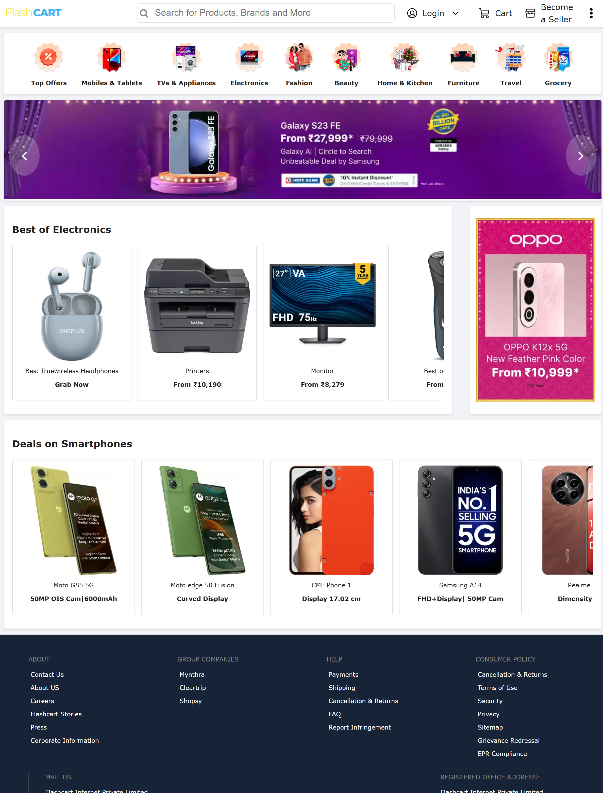

# Flipkart UI Clone

A responsive UI clone of Flipkart's homepage built with HTML and CSS, demonstrating strong front-end development fundamentals.



## 🚀 Features

- Pixel-perfect recreation of Flipkart's homepage layout
- Responsive design with mobile-first approach
- Semantic HTML5 structure
- Modern CSS3 styling with Flexbox
- Optimized image loading and performance
- Clean and maintainable code structure

## 🛠️ Technologies Used

- HTML5
- CSS3
- Font Awesome Icons
- Responsive Design Principles

## 📱 Responsive Design

The project is built with responsiveness in mind, adapting to different screen sizes:
- Desktop (1200px and above)
- Tablet (768px to 1199px)
- Mobile (below 768px)

## 🎯 Key Components

1. **Header Section**
   - Logo
   - Search bar with icon
   - Navigation menu
   - User actions (Login, Cart, Seller)

2. **Main Navigation**
   - Category icons with labels
   - Responsive grid layout

3. **Banner Section**
   - Hero image
   - Navigation arrows
   - Responsive image handling

4. **Product Sections**
   - Electronics showcase
   - Smartphone deals
   - Product cards with images and details

5. **Footer**
   - Multiple columns of links
   - Social media integration
   - Company information
   - Payment methods

## 💻 How to Run

1. Clone the repository:
```bash
git clone https://github.com/Julnar1/flipcart-ui-clone.git
```

2. Open `index.html` in your browser

## 🔧 Suggested Improvements

1. **Responsive Enhancements**
   - Implement a mobile menu hamburger
   - Add media queries for better tablet view
   - Optimize images for different screen sizes

2. **Performance Optimizations**
   - Implement lazy loading for images
   - Minify CSS
   - Use WebP images with fallbacks

3. **Accessibility Improvements**
   - Add ARIA labels
   - Improve color contrast
   - Add keyboard navigation

## 🎓 Learning Outcomes

This project demonstrates:
- Strong HTML5 semantic structure
- Advanced CSS3 styling techniques
- Responsive design principles
- Image optimization
- Clean code organization
- Attention to UI/UX details

## 🔗 Connect with Me

Julnar Nabeel
- GitHub: [@Julnar1](https://github.com/Julnar1)
- LinkedIn: [Julnar Nabeel](https://www.linkedin.com/in/julnar-nabeel/)

## 📝 License

© 2025 Julnar Nabeel. All rights reserved.

---
Built with ❤️ by [Julnar Nabeel] 